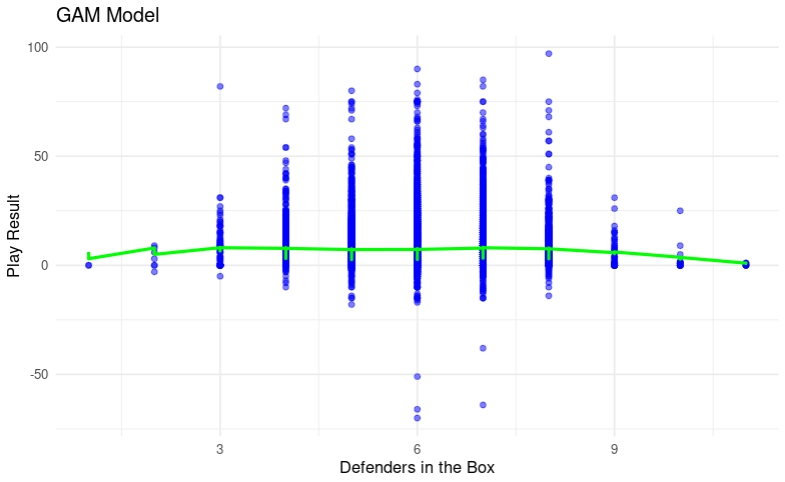
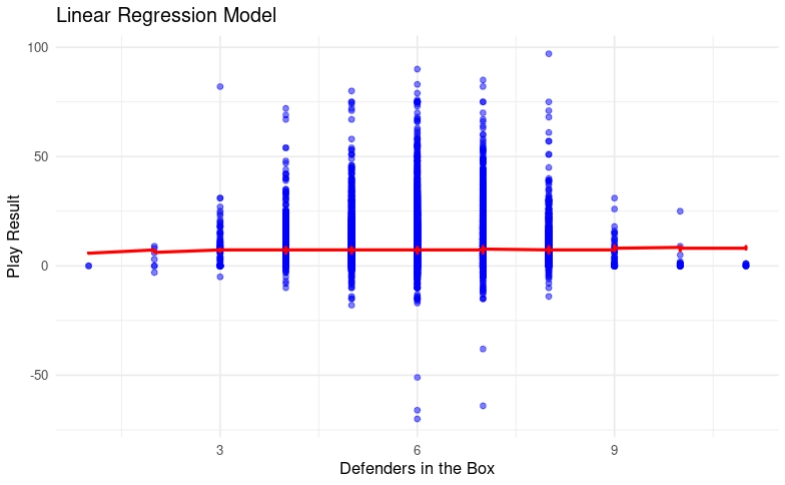
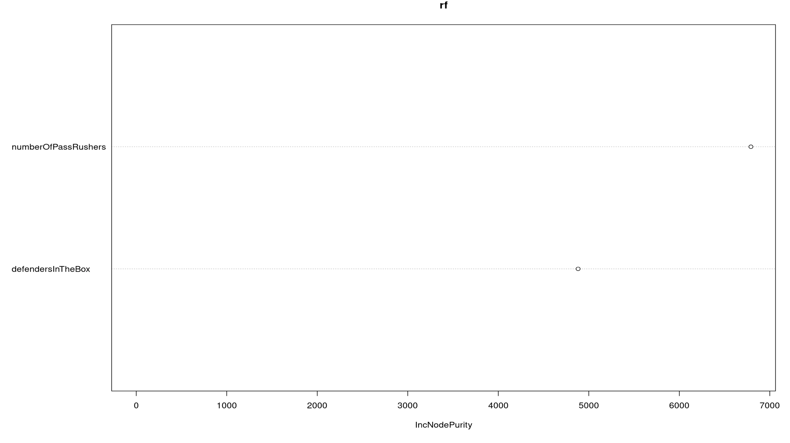

```{r setup, include=FALSE}
knitr::opts_chunk$set(echo = FALSE)
```

## Motivation and Design

**Main Point:** Understanding how defensive strategies impact NFL play outcomes.

-   **Focus:** Investigate if more defenders in the box reduce offensive yards gained.

-   **Significance:**

    -   Helps coaches balance between rushing and coverage plays.

    -   Guides decisions on optimizing defensive play-calling.

-   **Inspiration:**

    -   Shared passion for football and analytics.

    -   Contribute to the growing field of sports analytics.


## Methodology

-   Data Preparation
    -   Filtered passing plays; cleaned data to 17,330 observations. Response variable: offensive yards gained (excluding penalties). Predictors: number of defenders in the box and pass rushers. Exploratory Data Analysis (EDA):
    -   Visual tools: boxplots, heatmaps, correlation matrix. Pass rushers showed slightly stronger correlation with play result (0.032) than defenders in the box (0.006).

-   **Modeling:**
    -   Linear Regression: Captures direct linear relationships.
    -   Generalized Additive Model (GAM): Accounts for non-linear relationships with smooth terms.
    -   Train-test split (80/20) and 5-fold cross-validation for performance evaluation.

## Data Quality


# EDA

## Individual Variables

```{r message=FALSE, warning=FALSE}
if (!requireNamespace("ggplot2", quietly = TRUE)) install.packages("ggplot2")
if (!requireNamespace("gridExtra", quietly = TRUE)) install.packages("gridExtra")
if (!requireNamespace("dplyr", quietly = TRUE)) install.packages("dplyr")
library(dplyr)
library(ggplot2)
library(gridExtra)

plays <- read.csv("plays.csv")

plot1 <- ggplot(plays, aes(x = defendersInTheBox)) +
  geom_histogram(binwidth = 1, fill = "blue", color = "black") +
  xlab("Defenders in the Box") +
  ylab("Frequency") +
  ggtitle("Distribution of Defenders in the Box") +
  theme_minimal()

plot2 <- ggplot(plays, aes(x = numberOfPassRushers)) +
  geom_histogram(binwidth = 1, fill = "blue", color = "black") +
  xlab("Number of Pass Rushers") +
  ylab("Frequency") +
  ggtitle("Distribution of Pass Rushers") +
  theme_minimal()

plot3 <- ggplot(plays, aes(x = offensePlayResult)) +
  geom_histogram(binwidth = 5, fill = "blue", color = "black") +
  xlab("Offensive Play Result (Yards)") +
  ylab("Frequency") +
  ggtitle("Distribution of Offensive Play Results") +
  theme_minimal()

plot4 <- ggplot(plays, aes(x = epa)) +
  geom_histogram(binwidth = 0.5, fill = "blue", color = "black") +
  xlab("Expected Points Added (EPA)") +
  ylab("Frequency") +
  ggtitle("Distribution of EPA") +
  theme_minimal()

grid.arrange(plot1, plot2, plot3, plot4, ncol = 2, nrow = 2)
```

## Combinations

```{r message=FALSE, warning=FALSE}
plot5 <- ggplot(plays, aes(x = factor(numberOfPassRushers), y = playResult)) +
  geom_boxplot(fill = "blue") +
  xlab("Number of Pass Rushers") +
  ylab("Play Result (Yards)") +
  ggtitle("Play Result by Number of Pass Rushers") +
  theme_minimal()

plot6 <- ggplot(plays, aes(x = factor(down), y = playResult)) +
  geom_boxplot(fill = "blue") +
  xlab("Down") +
  ylab("Play Result (Yards)") +
  ggtitle("Play Result by Down") +
  theme_minimal()

counts <- plays %>%
  group_by(numberOfPassRushers, defendersInTheBox) %>%
  summarise(Count = n())
plot7 <- ggplot(counts, aes(x = factor(numberOfPassRushers), y = factor(defendersInTheBox), fill = Count)) +
  geom_tile() +
  xlab("Number of Pass Rushers") +
  ylab("Defenders in the Box") +
  ggtitle("Counts Heatmap") +
  scale_fill_gradient(low = "white", high = "red")

plot8 <- ggplot(plays, aes(x = factor(defendersInTheBox), y = playResult)) +
  geom_boxplot(fill = "blue") +
  xlab("Defenders in the Box") +
  ylab("Play Result (Yards)") +
  ggtitle("Play Result by Defenders in the Box") +
  theme_minimal()

grid.arrange(plot5, plot6, plot7, plot8, ncol = 2, nrow = 2)
```


# Model Results
   

## Results

    Number of Defenders in the Box and Pass Rushers vs. Play Result
    
    -In General, both linear regression and GAM explain very little variance 
    in playResult, with low R-squared values and high RMSE:

    Linear Regression RMSE: 9.847673 
    GAM RMSE: 9.834928

    -The number of pass rushers showed a strong relationship with playResult
    (Estimate coefficient = 0.381, P-value = 0.000162), compared to defenders 
    in the box (P-value = 0.985).  

    -The GAM slightly outperforms linear regression, but the improvement is
    not significant.  

## Gam Model



## Linear Regression Model


## Random Forest Results
  
    - The random forest was only able to accurately predict the relationship on
    playResult from defendersInTheBox and numberOfPassRushers with an accuracy
    of 4.53%
    - However, numberOfPassRushers had an importance score of 6791 and defenders
    in the box had importance score of 4881.880
  
   
## XGBoost Results

    -Test RMSE: 9.83
    -Slight improvements could be the result of less overfitting and 
    presence of interactions between features
  

## Predicting EPA With Pre-snap Variables

    -Variables used quarter, down, yards to go, offensive formation, 
    defenders in the box, and absolute yard number.
    
  

## References

The National Football League. 2021. NFL Big Data Bowl 2021. Retrieved Oct 29, 2024, from <https://www.kaggle.com/competitions/nfl-big-data-bowl-2021/data>

Kaplan, Andee. Statistical Learning, Class Notes. PDF File. 2024. <https://dsci445-csu.github.io/notes/2_stat_learning/20240829_2_stat_learning.pdf>

Kaplan, Andee. Regression, Class Notes. PDF File. 2024. <https://dsci445-csu.github.io/notes/3_regression/20240910_3_regression.pdf>

Kaplan, Andee. Classification, Class Notes. PDF File. 2024. <https://dsci445-csu.github.io/notes/4_classification/20240919_4_classification.pdf>

